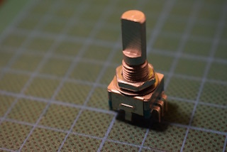
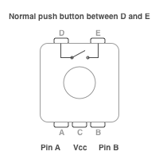

This has been moved to a larger toolkit at https://github.com/aleh/a21

---

# EC-11 Rotary Encoder Helper Library

This is a little library that helps to work with EC-11 style of rotary encoders on Arduino. The dependancy on Arduino functions is very small, so it can be easily ported to other platforms. See `ec11.hpp` for the docs and `examples` folder for a little demo.

## What exactly is EC-11?

It's a family of devices that look like potentiometers and allow your microcontroller to receive rotary input. They work as push button too. These are very cheap and available everywhere, but can provide very handy interface for your microcontroller projects.

Here is one of mine:

And this is its pinout:

Two pins are for the internal push button (D and E); the other two (A and B) provide rotation signal relative to the third pin (C), which is normally connected to the ground. The output pins A and B should be pulled high which can be done using internal pull up resitors of Arduino.

Note that rotary encoders can have more outputs and different purposes, but we assume only two outputs here and a simple case of manual control. 

Also note that when the encoder is rotated, then lines A and B are mechanical connected to pin C (ground) in certain order, which allows to detemine the direction of rotation. This mechanical switching generates noise. It can be filtered out, but for simple projects the noise can be ignored.
